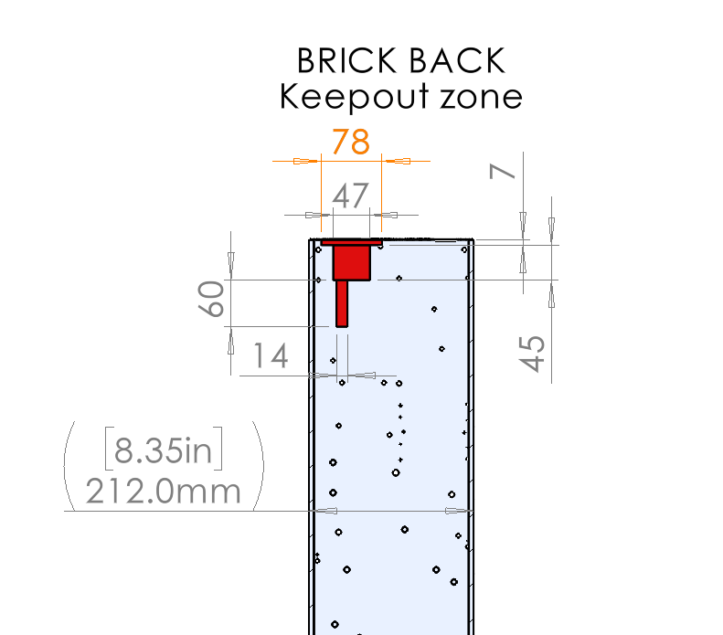
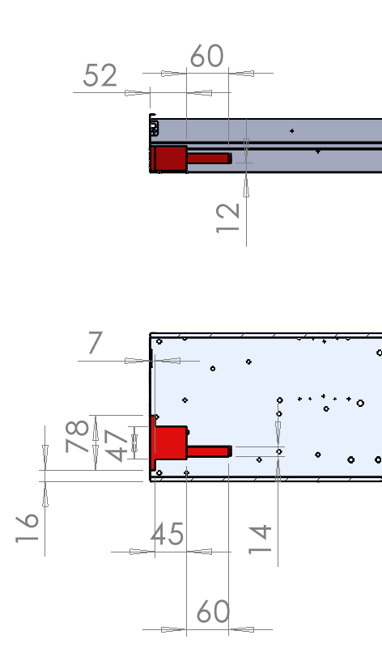
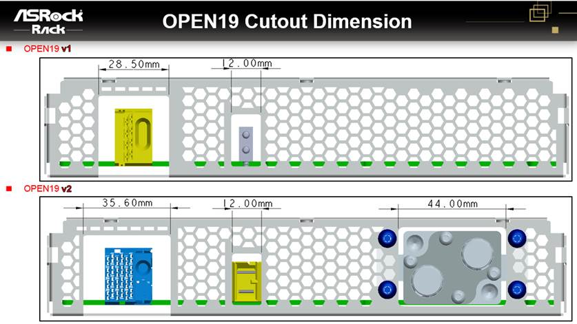

= Cooling working group

== 2022 Feb 3

No call for Lunar New Year

== 2022 Jan 27
=== Attendees
* Doug Asay, Equinix
* Erin McCann, Schneider Electric
* My Truong, Equinix
* John Leung, Inspur
* Julian Shui, Delta
* Mahyar Fotovatjah, ASUS
* Mealy Huang, Inspur
* Paul Chen, ASRock Rack
* Roy Grantham, Vertiv
* Samuel Cheung, ASUS
* Spike Lin, Inspur
* Suresh Pichai, Equinix
* Bob Wu, Inspur
* Dexter Tseng, Inspur
* Weishi Sa, ASRock Rack
* Claudia Chen, Inspur
* Peter Panfil, Vertiv
* Shahar Belkin, ZutaCore
* Brandy Bengtson, ZutaCore
* Mac Liu, CPC
* Nigel Gore, Vertiv
 
=== Discussion
* Blind mate connection for single-phase
* Locking mechanism and retention force
* Alignment-- gather and float. Is there enough for the brick?
 
* Veriv shared images of the rack with manifolds
* Schneider Electric is proposing CPC BLQ6 for single-phase connections
 
ACTION: Schneider Electric (Erin) Keep out zone inside the brick for single phase 

ACTION: Define a locking/retention mechanism

ACTION: Schneider Electric (Erin) will have final models
 
* Cooling call will be suspended for two weeks to observe Lunar New Year. Calls will resume Feb 17.

== 2022 Jan 20

=== Opens
Brick/cage cut out
Keep out zones internal to brick
Attachment points of bracket to cage standardized
Maximum available distance between back of cage to rack rear door
Air flow/area available for hot air to leave the server
 
=== Discussion
* ZutaCore supplied suggestions for cutout
* See below the preliminary dimensions for the ZutaCore 2PLC blind mate.
* The opening on the brick back panel and the cage back panel should be: 58x38mm
* The keep out zone for the brick is as follows:
* The dimensions are:
** The server cube with the blind mate connectors is 55X35 mm 
** As the cube is connected to the brick with sliders the cut out in the brick and cage needs to be 3mm bigger than the cube = 58x38 mm 
** The 78mm is the area needed on the brick wall including the sliders that hold the cube to the brick.
 

 
 
==== To finalize in next call (Jan 27)
Cutout on brick is 58x38mm.
Expand cutouts to the left (towards the data/power connector). Expanding to the right will not leave enough space for mounting bracket (as discovered in the mechanical call.)
400W "air cooled" will be accepted as-is.
 
ACTION: Inspur will confirm the new dimensions and keep out for cooling internal to brick can be supported in brick designs.

ACTION: ASRock Rack will confirm the new dimensions and keep out for cooling internal to brick can be supported in brick designs.

ACTION: ASUS will confirm the new dimensions and keep out for cooling internal to brick can be supported in brick designs.
 

== 2022 Jan 13

=== Attendees
* Julian Shui, Delta
* My Truong, Equinix
* Fred Rebarber, Vertiv
* Roy Grantham, Vertiv
* Peter Panfil, Vertiv
* John Leung, Inspur
* Trishan de Lanerolle, Linux Foundation
* Shahar Belkin, Zutacore

=== Discussion
- Keep out space for brick and cage. Need to finish keep outs in brick. Will try to close out in two weeks.
- ZutaCore will provide existing suggestions for keep out to Vertiv (Roy).

ACTION: Work with SE team on single-phase keep-out.

- Additional heat loads from accessories. Vertiv (Fred) is looking thermal models from server manufacturers. Fred will work with Six Sigma for data requirements.

   CTA: Provide/share any thermal models for server bricks that will land in racks. Fan curves and air flows are most interesting.

- Will we use ASHRE standards for liquid input? Need to discuss with the team.
 
