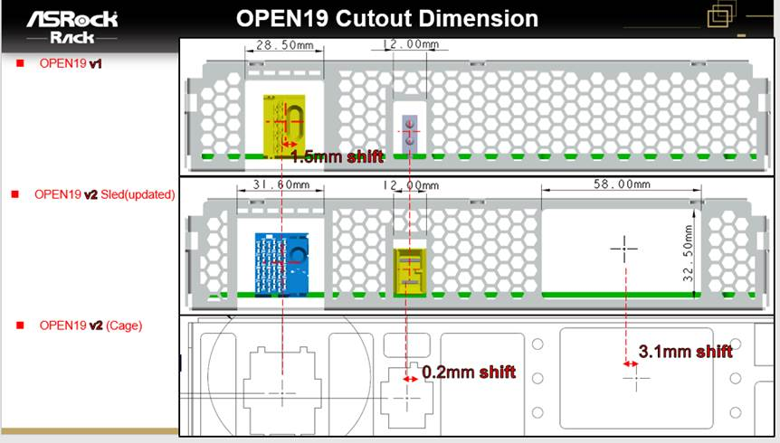

= Mechanical working group

== 2022 Feb 3

No call for Lunar New Year

== 2022 Jan 27

=== Attendees
* Christopher Liljenstolpe, Cisco
* Claudia Chen, Inspur
* Dexter Tseng, Inspur
* Erin McCann, Schneider Electric
* Fred Rebarber, Vertiv
* John Leung, Inspur
* Kay Lu, Inspur
* Mahyar Fotovatjah, ASUS
* Mealy Huang, Inspur
* Mike Smith, Vertiv
* Nigel Gore, Vertiv
* Paul Chen, ASRock Rack
* Peter Panfil, Vertiv
* Rob Bunger, Schneider Electric
* Roy Grantham, Vertiv
* Samuel Cheung, ASUS
* Spike Lin, Inspur
* Sutart Sheehan, Schneider Electric
* Weishi Sa, ASRock Rack
* Wilson Hung, ASRock Rack
* Greg Stover, Vertiv
 
=== Discussion:
* Drop calls next week for Lunar New Year. Calls will resume Feb 17.
* Vertiv is working to finish cuts and keep out zones.
* Image from ASRR on layouts. Inspur will follow up.

  ACTION: Vertiv will investigate differences.

* Vertiv presented some rack CAD models for exploring interferences. The teams have seen interference issues and noticed the brick models aren't accurate.

  ACTION: Brick vendors to supply more accurate brick models to check for interferences.

* Discussion about 12RU cage. No active deployers of 12RU cage. It could be synthetically created with an 8RU + 4RU cage.
* Call for commits into GitLab with artifacts. Please contact Equinix (My) or Cisco (Christopher) if you require access.

== 2022 Jan 20

=== Attendees
* Claudia Chen, Inspur
* Dexter Tseng, Inspur
* Rob Bunger, Schneider Electric
* Roy Grantham, Schneider Electric
* Weishi Sa, ASRock Rack
* Julian Shui, Delta
* John Leung, Inspur
* Samuel Cheung, ASUS
* Mike Smith, Vertiv
* Keegan McGraw, Molex
* Erin McCann, Schneider Electric
* Suresh Paichai, Equinix
* Chengjie Huang, Inspur
* Kay Lu, Inspur
* Peter Panfil, Vertiv
* Doug Asay, Equinix
* Glenn Wishnew, Vertiv
* Paul Chen, ASRock Rack
* Stuart Sheehan, Schneider Electric
* Or Farjun, ZutaCore
* Spike Lin, Inspur
* Mahyar Fotovatjah, ASUS

=== Discussion

* Presenting brick image from ASRock
* Will there be issues with air turbulence where cage cutouts aren't aligned to brick cutouts?

  ACTION: ASRock Rack (Weishi) will share 8RU cage model with square opening for study (to Vertiv (Roy))

* Showed models of the mated single-phase manifolds

  ACTION: ZutaCore (Or) to supply models of 3.5kW manifolds

== 2022 Jan 13

=== Attendees
* Christopher Lijenstolpe
* My Truong, Equinix
* Trishan de Lanerolle, Linux Foundation
* Keegan McGraw, Molex
* Julian Shui, Delta
* Fred Rebarber, Vertiv
* John Leung, Inspur
* Peter Panfil, Vertiv
* Roy Grantham, Vertiv
* Mike Smith, Vertiv
 
=== Discussion
- Panel cutout definition finalization. Vertiv (Roy) will integrate new cutouts for review with the team.
- Rack stack-up definitions.

  AI: End users provide stack-ups for mechanical interference studies.

- Is the weight spec in V1 sufficient? V1 brick weight specification is 25 lbs (11.4kg) https://gitlab.com/open19/v1-specification/-/blob/main/Open19-V1-Servers-specification.pdf[Specification]

  AI: Determine if any solutions will weigh more than 25 lbs (eg: flooded cooled bricks). This will be used to inform cage designs.
 
